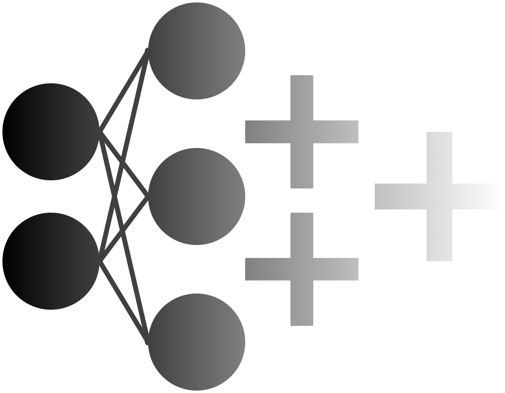

# Multi-Layer Perceptrons in C++


The tools in this library is designed for the **inference of deep, dense, feed-forward multi-layer perceptrons** in C++ applications.

The library supports the inference of multi-faceted queries, making it an effective tool for effortlessly processing the input and output of multiple networks.

Another key feature of MLPCpp is the **calculation of the Jacobian and Hessian** of the network output without the use of algorithmic differentiation. This feature makes MLPCpp an effective tool in physics-informed machine learning applications.

MLPCpp is **differentiable**, supporting usage in adjoint-based simulation codes such as SU2 and eventually, also network training. To clarify: MLPCpp **does not yet** support training. That is an ongoing project.

# Set-up and use
Accessing the tools within MLPCpp is as simple as including the header files in your project and calling its functions and classes through the ```MLPToolbox``` namespace.

# Inference
The main functionality of MLPCpp is the inference of MLPs. Networks can be initialized by loading them from an ASCII file or can be initated with randomized weights within the C++ environment.
Networks trained through external tools like TensorFlow can be translated into a corretly formatted MLPCpp input file using [this function](src/Tensorflow_Translation.py).

The process of network inference goes as follows. First, the network input is **scaled** at the input layer. MLPCpp supports three linear scaling methods:
1. [Min-max scaling](https://scikit-learn.org/stable/modules/generated/sklearn.preprocessing.MinMaxScaler.html#sklearn.preprocessing.MinMaxScaler)
2. [Scaling with standard deviation](https://scikit-learn.org/stable/modules/generated/sklearn.preprocessing.StandardScaler.html#sklearn.preprocessing.StandardScaler)
3. [Quantile-based scaling](https://scikit-learn.org/stable/modules/generated/sklearn.preprocessing.RobustScaler.html#sklearn.preprocessing.RobustScaler)

The output value of the nodes in the hidden layers is calculated with $y_i = \psi_i(x_i)$, where $\psi$ is the activation function applied to the hidden layer and $x_i$ the node input value calculated with $x_i = \sum_{j=0}^{N_{i-1}}w_{i-1, j}y_{i-1,j}$. The following activation functions are currently supported:
1. Linear (y = x)
2. Rectified linear unit (relu)
3. Exponential linear unit (elu)
4. Sigmoid linear unit (swish)
5. Sigmoid
6. Hyperbolic tangent (tanh)
7. Scaled exponential linear unit (selu)
8. Gaussian linear unit (gelu)
9. Exponential (y = exp(x))

The network output is retrieved by applying **inverse scaling** to the output of the nodes in the final layer of the network using the earlier mentioned scaling methods.

# Jacobians and Hessians
MLPCpp supports the evaluation of the network Jacobian and Hessian without the use of algorithmic differentiation, making it an attractive tool for physics-informed applications.
The Jacobian and Hessian of the network output are calculated **analytically**, making the method very efficient and not prone to truncation errors.

# Queries
Another key functionality of MLPCpp is the setup of **inference queries**. These queries allow users to **retrieve specific outputs** from **multiple networks** without having to interface with the network directly.
This powerful feature makes it easy to retrieve information from multiple networks without much bookkeeping and modification of the source code. Inference queries also support the retrieval of network Jacobian and Hessian information.


# Integrations
MLPCpp is currently used as a sub-module of the open-source CFD code [SU2](https://github.com/su2code/SU2.git) for data-driven fluid models used for the simulation of reacting and non-ideal compressible fluid flows (NICFD). Tutorials for these applications can be found [here](https://su2code.github.io/tutorials/Inc_Combustion/).
The training MLPs for the regression of fluid properties in combustion and NICFD applications can be done with the [SU2 DataMiner](https://github.com/su2code/SU2_DataMiner.git) software library. SU2 DataMiner can be used to generate training data, train MLPs for the regression of fluid properties, and writing the network weights and biases to the ASCII file format supported by MLPCpp.

# Test Case

Under ```TestCase```, one can find a demonstration of the MLPCpp library. [Here](TestCase/test_problem.py), an MLP with two inputs and one output is trained using TensorFlow, converted to MLPCpp ASCII format, and evaluated using the functions in the MLPCpp library. To compile the MLPCpp source code and run the test case, run the following commands:
```
cd TestCase
g++ ../main.cpp -o test_MLPCpp
python test_problem.py
```
This will train an MLP on some reference data, write the .mlp output file, and evaluate the network output using the MLPCpp module.

# Documentation

To generate HTML documentation, run this command from the repository root:

```bash
sphinx-build -b html docs docs/_build/html
```

The generated documentation will be available at:

```text
docs/_build/html/index.html
```

You can open `index.html` in a web browser to view the documentation locally.
